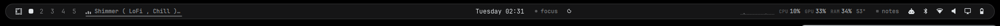
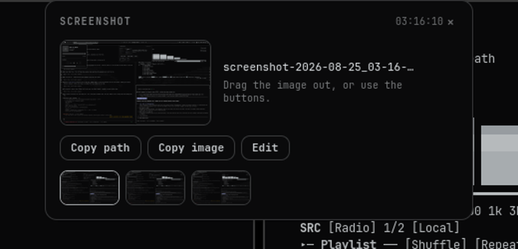

# omarchy-monochrome

A greyscale [Omarchy](https://omarchy.org) desktop: a floating rounded bar,
four custom Quickshell bar widgets, and a screenshot shelf that does not
disappear before you have decided what to do with the screenshot.

Built natively on Omarchy rather than by dropping in foreign dotfiles — nothing
here forks or patches `/usr/share/omarchy/`, so `omarchy update` stays safe.



## What's in here

### Bar widgets — `bar/modules/`

| Module | What it does |
|---|---|
| `mediapill.qml` | Now-playing. Idle it is an animated equaliser glyph and an elided track label over a progress hairline. Hover fills the pill in, slides out prev / play-pause / next, and marquees the label. Click opens a panel with artwork, a scrubbable timeline, shuffle/repeat, volume and a source switcher. |
| `sysmon.qml` | CPU / GPU / RAM / temperature with a CPU sparkline, and a detail pop-out. |
| `pomodoro.qml` | Focus timer — 15/25/45/60/90. |
| `notes.qml` | Scratchpad that saves itself 900ms after you stop typing. |

### Plugins — `plugins/`

| Plugin | What it does |
|---|---|
| `ghost.barisland` | Paints a rounded floating plate behind the bar. Omarchy's bar cannot be detached from the screen edge, so the bar is made taller and transparent and this draws an island inside that band, on the layer below. |


### Screenshot shelf — `shotshelf/`



Replaces Omarchy's five-second screenshot toast with a shelf that stays until
you dismiss it, collapses to a chip, fans out the last six shots, and lets you
**drag the image straight into another application**.

A GTK4 app rather than a Quickshell plugin, and that is forced — see
[Notes on the screenshot shelf](#notes-on-the-screenshot-shelf).

### Theme — `themes/monochrome/`

Forked from Omarchy's **Vantablack**. Total greyscale, no colour in any ANSI
slot. Near-black `#0a0a0b` base, cool ash `#dfe3e6` foreground.

## Install

Requires Omarchy 4.x (Hyprland + Quickshell). The screenshot shelf also needs
`gtk4`, `python-gobject`, `libadwaita` and `wl-clipboard`.

```bash
git clone https://github.com/TheFadGhost/omarchy-monochrome
cd omarchy-monochrome

# Back up what you have first.
cp ~/.config/omarchy/shell.json ~/.config/omarchy/shell.json.bak

mkdir -p ~/.config/omarchy/bar/modules ~/.config/omarchy/bar/scripts
cp bar/modules/*.qml   ~/.config/omarchy/bar/modules/
cp bar/scripts/sysmon  ~/.config/omarchy/bar/scripts/
chmod +x ~/.config/omarchy/bar/scripts/sysmon
cp -r plugins/ghost.*  ~/.config/omarchy/plugins/

# Screenshot shelf (needs gtk4, python-gobject, libadwaita).
mkdir -p ~/.local/share/ghost-shotshelf ~/.local/bin
cp -r shotshelf/* ~/.local/share/ghost-shotshelf/
cp bin/ghost-*    ~/.local/bin/
chmod +x ~/.local/bin/ghost-* ~/.local/share/ghost-shotshelf/shim/*
cp hypr/windows.lua ~/.config/hypr/          # then require("hypr.windows")
cp -r themes/monochrome ~/.config/omarchy/themes/

# The bar is made 44px tall so the island has room to float inside it.
cp examples/shell.toml ~/.config/omarchy/shell.toml

omarchy restart shell
omarchy theme set Monochrome
```

Then register the widgets. `examples/shell.json` is a complete working file you
can copy wholesale, or crib the relevant bits: each custom module goes in
`bar.layout.<section>` as `{"id": "<name>", "type": "qml"}`, and each plugin as
`{"id": "ghost.<name>"}` in the top-level `plugins[]` array.

`mediapill` is intended to replace the first-party `omarchy.media` widget —
drop `{"id": "omarchy.media"}` when you add it, or you will have two.

## Design

Everything here is built from Omarchy's own UI components — `PopupCard`,
`BorderSurface`, `PanelSectionHeader`, `PanelSeparator`, `PanelSlider`,
`Ui/Button` — with sizes from `Style.space()`, fonts from `Style.font.*` and
colours from `Color.*`. Nothing is a hardcoded pixel value or hex literal, so
all of it re-themes with the rest of the shell.

That works because user QML can `import qs.Ui` and `import qs.Commons` even
from outside `/usr/share/omarchy/shell`: the shell is one Quickshell engine,
that path is the `qs` module namespace, and `qs.*` resolves against the engine
rather than the importing file's directory.

## Notes on the screenshot shelf

### Why it is GTK4 and not Quickshell

The shelf started as a Quickshell plugin (still in git history) and could never
drag. Two independent blockers:

1. **QtQuick's `Drag` is scene-local.** Its `DragType` enum is
   `None`/`Automatic`/`Internal` — there is no `External` — and Quickshell
   registers no drag-and-drop types at all. Real cross-application drag needs
   C++ calling `QDrag::exec()`.
2. **The drag must not originate from a layer-shell surface.** wlroots
   validates a drag against the seat's last pointer-button serial *and*
   requires the origin surface to hold pointer focus; layer surfaces usually
   hold neither. KWin has a filed crash for exactly this pattern (bug 502497),
   and every app that drags files out on Wayland — Flameshot, Nautilus — uses
   an ordinary `xdg_toplevel`.

So the shelf is a normal toplevel window made to behave like an overlay, using
the same Hyprland rules Omarchy's own webcam overlay uses (`float`, `pin`,
`no_initial_focus`, `no_follow_mouse`). Focus stays where you were typing.

### The one detail that makes the drag actually work

```python
Gdk.ContentProvider.new_for_value(Gio.File.new_for_path(path))   # WRONG
Gdk.ContentProvider.new_for_value(Gdk.FileList.new_from_list([f]))  # right
```

The first is what most tutorials show. It is wrong: the GValue carries the
concrete type `GLocalFile`, GDK registers its serialisers against the `GFile`
*interface*, nothing matches, and the drag advertises **zero** mime types — it
looks completely correct and silently fails on every drop. Measured:

```
new_for_value(GFile)       -> ON THE WIRE: []
new_for_value(GdkFileList) -> ['text/uri-list', 'text/plain;charset=utf-8',
                               'application/vnd.portal.filetransfer', ...]
```

Check any change with
`provider.ref_formats().union_serialize_mime_types().get_mime_types()`.

### Replacing the stock toast

`bin/ghost-capture` runs Omarchy's own `omarchy-capture-screenshot` with a
directory prepended to `PATH` holding a no-op `omarchy-notification-send`.
Scoped to that one process tree, so every other Omarchy notification still
works. Bind `PRINT` to it — and call `hl.unbind("PRINT")` first, or Hyprland
keeps both binds and fires two captures.

## Documentation

[`docs/CUSTOMISATIONS.md`](docs/CUSTOMISATIONS.md) is the full recovery
reference for the machine this came from — every change, why it was made, and
the QML/Quickshell gotchas found the hard way (§6b and §6d are the useful ones
if you are writing your own widgets).

## Licence

MIT — see [LICENSE](LICENSE), which covers the code in this repo only.

The wallpaper in `themes/monochrome/backgrounds/` is **not mine and not MIT**.
`0-dot-hands.jpg` is dot-matrix artwork by [@samdape](https://x.com/samdape) —
his handle is watermarked into the bottom-right of the image. It ships with
Omarchy in the `vantablack` theme (and as `2-dot-hands.jpg` in `matte-black`),
and it keeps whatever terms it carries there. If you fork this, keep the credit.
